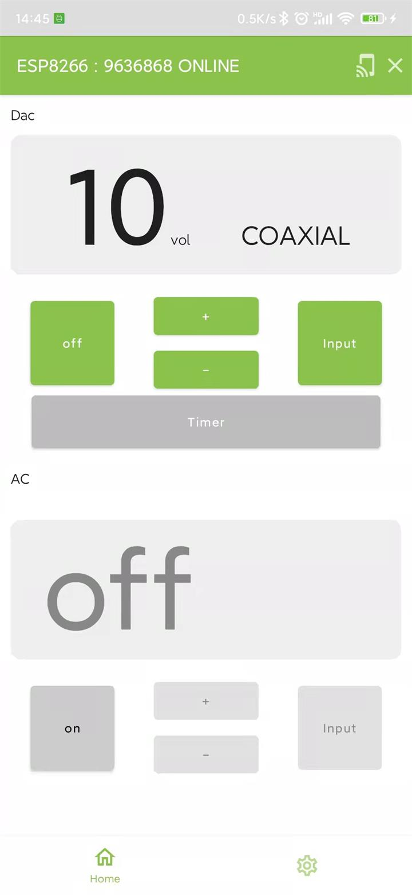

# using esp8266 and Aliyun implementation simple remote control for DAC

## Device

```ini
platform = espressif8266
board = nodemcuv2
framework = arduino

platform = espressif32
board = esp32dev
framework = arduino
```

contains below practice:

## Libraries or Features

 - ESP8266 and ESP32 OLED driver for SSD1306 displays
 - EspMQTTClient
 - NTPClient
 - IRremote
 - Preferences
 - SmartConfig
 - Uart
 - Json

## Other technique

 - aliyun-iot

 - compose

    

    


